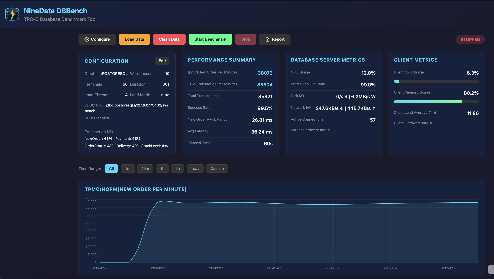

# NineData DBBench

<p align="center">
  
</p>

<p align="center">
  <strong>TPC-C Database Benchmark Tool</strong>
</p>

<p align="center">
  A universal TPC-C benchmark tool supporting multiple databases with real-time web monitoring dashboard.
</p>

---

## Features

- **Multi-Database Support**: MySQL, PostgreSQL, Oracle, SQL Server, DB2, TiDB, OceanBase, Dameng, SQLite, YashanDB, Sybase, SAP HANA
- **Full TPC-C Implementation**: All 5 transaction types with configurable mix
- **Real-Time Dashboard**: Web UI with live charts, time range selector, and metrics
- **CSV Fast Load**: Database-native bulk import for faster data loading (MySQL LOAD DATA, PostgreSQL COPY, etc.)
- **Dual Mode**: CLI for automation, Web UI for interactive use
- **Comprehensive Metrics**: Transaction, Database, OS, and Database Host metrics collection with up to 1 hour history retention
- **Easy Configuration**: JDBC URL based connection, auto database type detection

## Supported Databases

| Database | JDBC URL Format |
|----------|-----------------|
| MySQL | `jdbc:mysql://host:3306/database` |
| PostgreSQL | `jdbc:postgresql://host:5432/database` |
| Oracle | `jdbc:oracle:thin:@host:1521:sid` |
| SQL Server | `jdbc:sqlserver://host:1433;databaseName=db` |
| DB2 | `jdbc:db2://host:50000/database` |
| TiDB | `jdbc:mysql://host:4000/database` |
| OceanBase | `jdbc:oceanbase://host:2881/database` |
| Dameng | `jdbc:dm://host:5236/database` |
| SQLite | `jdbc:sqlite:./tpcc.db` |
| YashanDB | `jdbc:yasdb://host:1688/database` |
| Sybase | `jdbc:jtds:sybase://host:5000/database` |
| SAP HANA | `jdbc:sap://host:30015/?databaseName=database` |

#### Main Dashboard


#### Configuration Panel


## Docker Quick Start (Recommended) 
```bash
docker run -d -p 1929:1929 --name dbbench yzsind/dbbench:latest
```

Open http://localhost:1929 in your browser to start testing.


## Build from Source
### Prerequisites

- Java 17+ (or Docker)
- Maven 3.6+ (for building from source)
- Target database with an empty database created

```bash
git clone https://github.com/yzsind/dbbench.git
cd dbbench
mvn clean package -DskipTests
```

### Web Mode

Start the web server:

```bash
java -jar target/dbbench-0.8.0.jar
```

Open http://localhost:1929 in your browser.

From the web dashboard you can:
1. Configure database connection and test it
2. Load TPC-C test data
3. Start/Stop benchmark
4. Monitor real-time metrics (tpmC, CPU, Network, etc.)
5. View detailed logs

### CLI Mode

CLI mode reads all configuration from a profile file (`-f`), the same format used by the Web UI.

```bash
# Load test data
java -jar target/dbbench-0.8.0.jar -f profiles/local-mysql.properties load

# Run benchmark (data must be loaded first)
java -jar target/dbbench-0.8.0.jar -f profiles/local-mysql.properties run

# Clean existing data
java -jar target/dbbench-0.8.0.jar -f profiles/local-mysql.properties clean

# Combine actions: clean → load → run
java -jar target/dbbench-0.8.0.jar -f profiles/local-mysql.properties clean load run

# Override specific settings from config file
java -jar target/dbbench-0.8.0.jar -f profiles/local-mysql.properties -w 20 -c 100 -d 300 run
```

## CLI Options

| Option | Description |
|--------|-------------|
| `-f, --config` | Configuration file path (required) |
| `-w, --warehouses` | Override warehouses count |
| `-c, --terminals` | Override terminal count |
| `-d, --duration` | Override test duration (seconds) |
| `-h, --help` | Show help message |
| `-V, --version` | Show version |

Actions (positional, can combine multiple):
| Action | Description |
|--------|-------------|
| `clean` | Clean existing test data |
| `load` | Load TPC-C test data |
| `run` | Run benchmark |

## Configuration File

Configuration files use `.properties` format and are stored in the `profiles/` directory. The same format is shared between CLI mode and Web UI profiles.

```properties
# Database Connection
db.type=mysql
db.jdbc-url=jdbc:mysql://127.0.0.1:3306/tpcc?useSSL=false&allowPublicKeyRetrieval=true&rewriteBatchedStatements=true
db.username=root
db.password=password
db.pool.size=50
db.pool.min-idle=10

# SSH (for remote database host metrics)
db.ssh.enabled=false
db.ssh.host=192.168.1.100
db.ssh.port=22
db.ssh.username=root
db.ssh.password=

# Benchmark Settings
benchmark.warehouses=10
benchmark.terminals=50
benchmark.duration=60
benchmark.think-time=false
benchmark.load-concurrency=4
benchmark.load-mode=auto

# Transaction Mix (TPC-C Standard, must total 100%)
benchmark.mix.new-order=45
benchmark.mix.payment=43
benchmark.mix.order-status=4
benchmark.mix.delivery=4
benchmark.mix.stock-level=4
```

## Docker Environment Variables

All configuration can be overridden via environment variables:

| Variable | Description | Default |
|----------|-------------|---------|
| `SERVER_PORT` | Web server port | 1929 |
| `DB_TYPE` | Database type | mysql |
| `DB_JDBC_URL` | JDBC connection URL | jdbc:mysql://... |
| `DB_USERNAME` | Database username | root |
| `DB_PASSWORD` | Database password | (empty) |
| `DB_POOL_SIZE` | Connection pool size | 50 |
| `BENCHMARK_WAREHOUSES` | Number of warehouses | 10 |
| `BENCHMARK_TERMINALS` | Concurrent threads | 50 |
| `BENCHMARK_DURATION` | Test duration (seconds) | 60 |
| `BENCHMARK_LOAD_CONCURRENCY` | Data loading threads | 4 |
| `BENCHMARK_LOAD_CONCURRENCY` | Data loading threads | 4 |
| `BENCHMARK_CSV_LOAD` | Use CSV bulk loading (true/false) | false |
| `JAVA_OPTS` | JVM options | -Xms512m -Xmx1024m |

## REST API

| Endpoint | Method | Description |
|----------|--------|-------------|
| `/api/benchmark/config` | GET | Get current configuration |
| `/api/benchmark/config` | POST | Update configuration |
| `/api/benchmark/test-connection` | POST | Test database connection |
| `/api/benchmark/init` | POST | Initialize database connection |
| `/api/benchmark/load` | POST | Load TPC-C data |
| `/api/benchmark/clean` | POST | Clean test data |
| `/api/benchmark/start` | POST | Start benchmark |
| `/api/benchmark/stop` | POST | Stop benchmark |
| `/api/benchmark/status` | GET | Get current status |
| `/api/benchmark/logs` | GET | Get activity logs |
| `/api/metrics/current` | GET | Get current metrics |
| `/api/metrics/history` | GET | Get metrics history (default: up to 3600 snapshots) |
| `/api/metrics/tps-history` | GET | Get tpmC history (default: up to 3600 snapshots) |
| `/api/metrics/hardware-info` | GET | Get client and DB server hardware info |
| `/api/report/markdown` | GET | Get benchmark report in Markdown |
| `/api/report/download/markdown` | GET | Download benchmark report as .md file |

## WebSocket

Connect to `ws://localhost:1929/ws/metrics` for real-time metrics streaming.

Message types:
- Metrics update: `{ "transaction": {...}, "client": {...}, "database": {...} }`
- Status change: `{ "type": "status", "status": "RUNNING" }`
- Progress update: `{ "type": "progress", "progress": 50, "message": "Loading..." }`
- Log entry: `{ "type": "log", "log": { "level": "INFO", "message": "..." } }`

## TPC-C Transaction Mix

| Transaction | Default % | Description |
|-------------|-----------|-------------|
| New-Order | 45% | Creates new orders with 5-15 line items |
| Payment | 43% | Processes customer payments |
| Order-Status | 4% | Queries order status (read-only) |
| Delivery | 4% | Processes pending deliveries |
| Stock-Level | 4% | Checks stock levels (read-only) |

## Metrics Collected

### Transaction Metrics
- Throughput (tpmC)
- Total transactions count
- Success/Failure counts and rates
- Latency (average, min, max)
- Per-transaction type breakdown

### Database Metrics
- Active connections
- Buffer pool / Cache hit ratio
- Row lock waits
- Slow queries count

### Database Host Metrics (via SSH)
- CPU usage (%)
- Memory usage (%)
- Disk I/O (read/write bytes/sec)
- Network I/O (recv/sent bytes/sec)

### Client Metrics (Local Machine)
- CPU usage (%)
- Memory usage (%)
- Load average (1m, 5m, 15m)
- Network I/O (bytes/sec)
- Disk I/O (bytes/sec)

## Data Scale

Per warehouse (approximately):
| Table | Rows |
|-------|------|
| Item | 100,000 (shared) |
| Warehouse | 1 |
| District | 10 |
| Customer | 30,000 |
| History | 30,000 |
| Order | 30,000 |
| New-Order | 9,000 |
| Order-Line | ~300,000 |
| Stock | 100,000 |

**Recommended sizing:**
- Small test: 1-10 warehouses, 5-10 terminals
- Medium test: 10~1000 warehouses, 50 terminals
- Large test: 1000+ warehouses, 200+ terminals

## Screenshots

### Web Dashboard
The web dashboard provides real-time monitoring with:
- Configuration panel with connection testing
- Performance summary (tpmC, TPM, latency, success rate)
- Time range selector (All / 1m / 10m / 1h / 6h / 1day / Custom) for chart zoom
- Smart downsampling for smooth chart rendering at any time scale
- Database host metrics (CPU, Memory, Disk I/O, Network I/O, Connections)
- Client metrics (CPU, Memory, Network I/O)
- tpmC chart over time
- Transaction breakdown table with Rollback/Error split
- Activity logs
- Benchmark report generation (Markdown / PDF)

## Development

### Project Structure

```
src/main/java/com/ninedata/dbbench/
├── cli/                    # CLI runner
├── config/                 # Configuration classes
├── database/               # Database adapters
├── engine/                 # Benchmark engine
├── metrics/                # Metrics collection
├── tpcc/                   # TPC-C implementation
│   ├── loader/             # Data loader
│   └── transaction/        # Transaction implementations
└── web/                    # REST API & WebSocket

src/main/resources/
├── static/                 # Web UI (HTML, CSS, JS)
├── application.properties  # Default configuration
└── banner.txt              # Startup banner
```

### Building from Source

```bash
# Build
mvn clean package

# Run tests
mvn test

# Run with Maven
mvn spring-boot:run
```

## License

Apache License 2.0

## Contributing

Contributions are welcome! Please feel free to submit a Pull Request.

## Acknowledgments

- TPC-C Benchmark Specification: [TPC](http://www.tpc.org/tpcc/)
- Built with Spring Boot, Chart.js, OSHI
